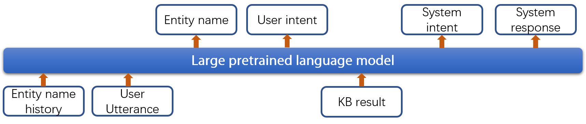

# Baseline for SereTOD Track2
This repository contains the baseline code for SereTOD Track2.
## Update 
**2022.08.15** Update baseline results on **official dev set**. Participants need to put the data in `Test_data` directory and rename it to `dev_data.json`, then run
```
python preprocess.py --dir Test_data/ --file dev_data.json
bash test_dev.sh $DEVICE $MODEL_PATH
```
The results of the baseline model on dev set are:
   - P/R/F1 for user intent: 0.720/0.623/0.668
   - P/R/F1 for system intent: 0.610/0.508/0.554
   - BLEU-4 score: 4.12
   - Success rate: 0.244
## Requirement
After you create an environment with `python 3.6`, the following commands are recommended to install the required packages
* pip install torch==1.5
* pip install transformers==3.5
* pip install nltk
* pip install tensorboard
* pip install tqdm
## Data Preprocessing
First, you need to put raw data in `Track2_data` directory and rename it to `Raw_data.json`, then run
```
python preprocess.py
```
This script basically includes the following steps: 
1. Reconstruct the data so that users speak before the customer service in every turn;
2. Normalize the data;
3. Extract the user goal and local KB for every dialog
## Training
In this baseline, we divide the dialog system into several subtasks. For every dialog turn, we need to:
* predict the entity name mentioned or referred to by the user 
* predict the user intent
* query local KB using the predicted user intent
* predict system intent
* predict system response

We maintain a list of entity names (entity name history), which are mentioned by the user in previous turns. The entity name history and user utterance are fed into the model as the conditioning input to complete the above subtasks. 
Similar to [Liu et al.,2022](https://arxiv.org/abs/2204.06452), we employ a Markovian generative architecture (MGA) based on [Chinese GPT-2](https://huggingface.co/uer/gpt2-chinese-cluecorpussmall) to implement the dialog system, whose structure overview is as follows.


During training, the labeled data is splited into training set, validation set and test set with 8:1:1 ratio. You can train the dialog system with all labeled training data
```
bash train.sh $DEVICE
```
`$DEVICE` can be "cpu" or GPU such as "cuda:0". 
## Testing
Only local KB and dialog history are used in testing. You can perform end-to-end evaluation on the test set
```
bash test.sh $DEVICE $MODEL_PATH
```
The results of the baseline model are: 
   - P/R/F1 for user intent: 0.666/0.624/0.644
   - P/R/F1 for system intent: 0.614/0.534/0.571
   - BLEU-4 score: 4.17
   - Success rate: 0.315
